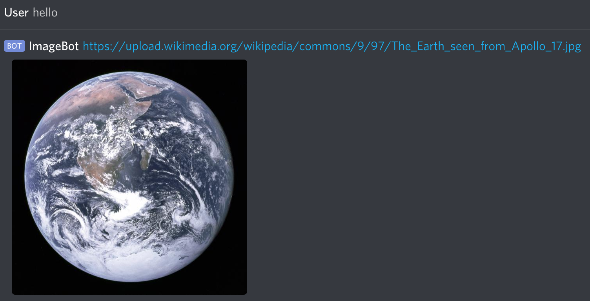

# DiscordImageBot

# Purpose
This bot's purpose is to scan chat messages and post a response in reply to keywords.

# Setup
## Create Application and Discord Bot
1. Go to the [Discord Developer Dashboard](https://discordapp.com/developers/applications/) and create a new Discord application by clicking __New Application__.
    - The Application name can be whatever you want it to be, but this will also be the name that appears in the Discord channel. __Note__: This _can_ be changed later.
2. In the left side menu, select __Bot__ to open the Bots page, and click __Add Bot__ to create a new bot for the application.
    - You may wish to disable public access to this bot. You can do this by unchecking the _Public Bot_ option.
3. Under _Token_ there should be a _Click to Reveal Token_ link. Click this to reveal your token, as you'll need it for the next section.
## Configure Files
4. Configuration is minimal, user will simply need to update [auth.json](./auth.json) with their Discord Bot's Token (taken from step 3 above).
## Install Dependencies
5. DiscordImageBot requires the following dependencies:
- NodeJS
  - Can use `curl -sL https://deb.nodesource.com/setup_6.x -o nodesource_setup.sh; sudo bash nodesource_setup.sh` to download and install.
- NPM
  - Can use `sudo apt install npm` to install.
- Discord.js
  - Use `npm install -g discord.js` to install.
- PM2 (optional)
  - Use `npm install -g pm2` to install. PM2 is a process manager that will run and restart your bot when needed.
## Launch Bot
6. Use `node bot.js` (or `pm2 start bot.js` if using PM2) to start the Discord Image Bot.
## Add Bot to Discord Server
7. Navigate back to the Application's _General Information_ page, and look for the _Client ID_. Copy this for step 9.
8. In a separate window/tab follow [this](https://discordapp.com/oauth2/authorize?&client_id=YOUR_CLIENT_ID_HERE&scope=bot&permissions=0) link. This link will take you to Discord's oauth page, but since it's currently just `YOUR_CLIENT_ID_HERE` it will display an error.
9. In the URL, replace YOUR_CLIENT_ID_HERE with the Client ID copied in step 7, and go to that link.
10. In the page displayed, the Bot you created will need to be directed to a server to join. Use the dropdown to select your server and click __Authorize__. __Note__: You need admin rights to the Discord server for it to appear.

### Your bot should now be configured and running in your Discord Server! Use `Admin`, `Mod`, or `Moderator` roles to give users access rights to modify the bot.

# Defaults
While the bot is ready to run with default settings, you may choose to customize it further. Modify the [config.json](./config.json) file to customize your bot.

Some examples of things you can do:
- Change `"prefix": "!"` to modify the bot's command prefix. `!add`
- Change `"commands": "commands.json"` to modify the command JSON file the bot should be using. If you change this you will need to rename [commands.json](./commands.json) to the new file name.
- Change or add roles to `"roles": ["Admin", "Mod", "Moderator"]`
  - These are the default roles the bot will check for when a user attempts to configure the bot through Discord. If the user does not have one of these roles they will only be able to receive responses from the bot, and will not be able to use `!add`, `!remove`, etc.